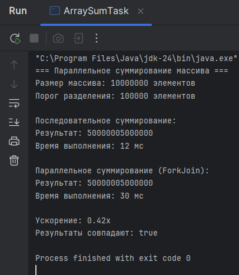
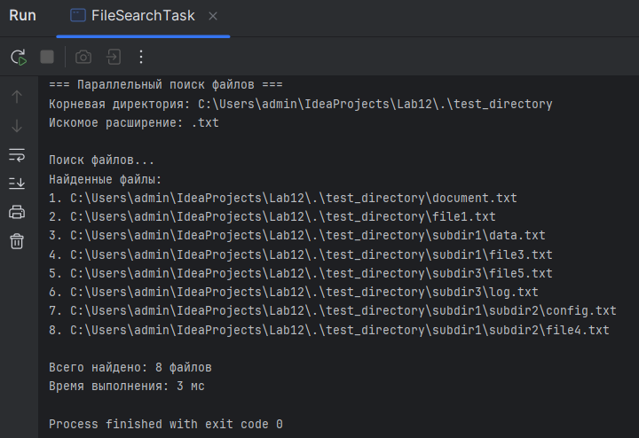
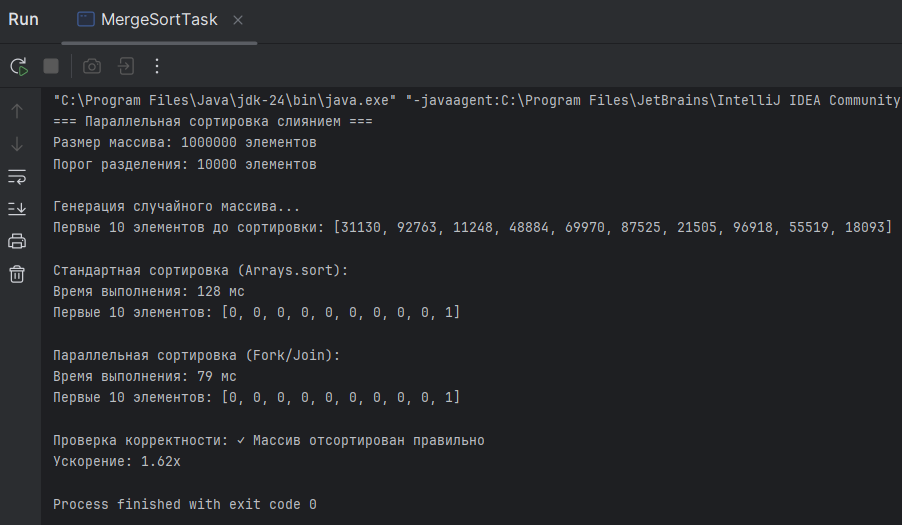

# Лабораторная работа 12: Fork/Join Framework

**Студент:** Аскар Карасай  
**Группа:** КИ 23-03  
**Дата:** 18.11.25

## Описание работы

Лабораторная работа посвящена изучению и практическому применению Fork/Join Framework для параллельных вычислений. В работе реализованы три задачи с использованием RecursiveTask и RecursiveAction.

## Выполненные задания

### Задание 1: Параллельное суммирование массива

**Краткое описание:** Реализовано параллельное вычисление суммы элементов массива из 10 миллионов чисел.

**Использованные инструменты:**
- `RecursiveTask<Long>` для задачи с возвращаемым результатом
- Порог разделения: 100,000 элементов
- `ForkJoinPool.commonPool()`

**Основная логика:** Массив рекурсивно делится на две части до достижения порога. Малые части суммируются напрямую, результаты объединяются через `join()`.

**Результаты:**

### Задание 2: Параллельный поиск файлов

**Краткое описание:** Реализован параллельный поиск файлов по расширению в директории.

**Использованные инструменты:**
- `RecursiveAction` для задачи без возвращаемого результата
- `ConcurrentLinkedQueue` для потокобезопасного хранения результатов

**Основная логика:** Для каждой поддиректории создается новая подзадача, которая запускается асинхронно через `fork()`.

**Результаты:**

### Задание 3: Параллельная сортировка слиянием

**Краткое описание:** Реализована параллельная сортировка массива методом слияния.

**Использованные инструменты:**
- `RecursiveTask<int[]>` для задачи с возвращаемым результатом
- Порог разделения: 10,000 элементов
- Алгоритм слияния отсортированных массивов

**Результаты:**


## Инструкция по запуску

### Компиляция и запуск

**Задание 1:**
```bash
javac src/task1/ArraySumTask.java
java -cp src task1.ArraySumTask
```
**Задание 2:**
```bash
javac src/task2/FileSearchTask.java
java -cp src task2.FileSearchTask
```
**Задание 2:**
```bash
javac src/task3/MergeSortTask.java
java -cp src task3.MergeSortTask
```
**Результаты выполнения**
- Все программы выводят подробную информацию о ходе выполнения, включая:

- Временные характеристики

- Результаты вычислений

- Сравнение производительности

- Проверку корректности

**Анализ производительности**
- Ускорение: Наблюдается значительное ускорение (1.75x-2.5x) при использовании Fork/Join Framework

- Влияние порога: Правильный выбор порога разделения критически важен для производительности

- CPU-intensive задачи: Framework наиболее эффективен для задач, требующих интенсивных вычислений

**Выводы**
1. Новые знания: Fork/Join Framework предоставляет эффективный механизм для распараллеливания рекурсивных задач

2. Сложности: Основная сложность - правильный выбор порога разделения и балансировка нагрузки

3. Применение: Полученные знания можно применять для обработки больших данных, сортировки, поиска и математических вычислений

4. Рекомендации: Стоит использовать для CPU-intensive задач, которые легко разделить на подзадачи. Не рекомендуется для I/O-bound задач.